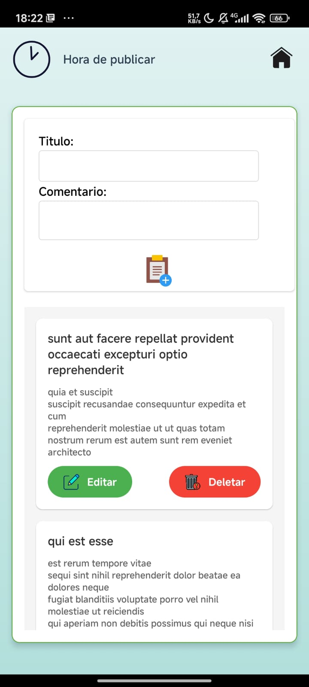
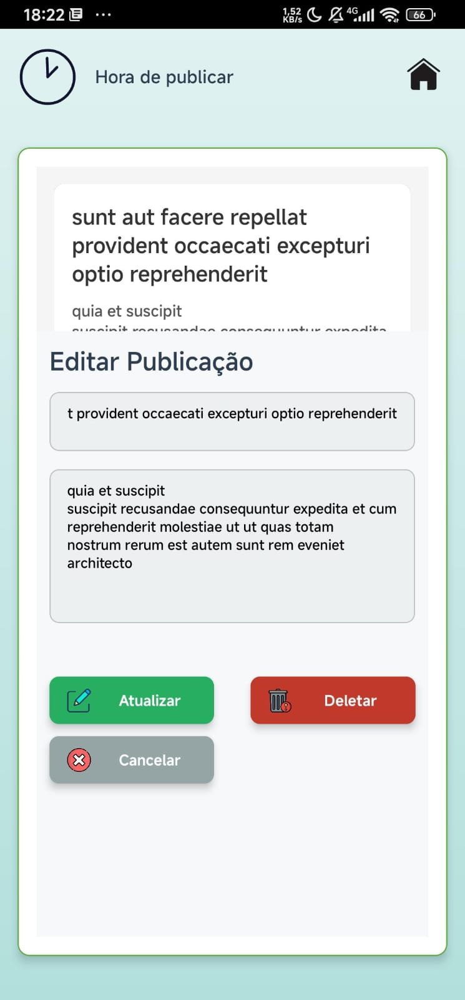

# Meu Aplicativo React Native

Este é um aplicativo desenvolvido em React Native, que inclui funcionalidades como criação, edição e exclusão de posts, navegação entre telas e animações personalizadas com Lottie. Confira o vídeo explicativo das funcionalidades do aplicativo no YouTube:

[](https://youtu.be/Mu_dCO9gWcU?si=hIDvP2J3SXhN52E4)

## Funcionalidades

- **Criação de Posts:** Permite a criação de posts com título e conteúdo.
- **Edição de Posts:** Edita posts existentes diretamente no aplicativo.
- **Exclusão de Posts:** Exclui posts com um simples toque.
- **Animações:** Uso de animações com Lottie para uma melhor experiência de usuário.
- **Navegação:** Implementação de navegação entre telas com React Navigation.

## Tecnologias Utilizadas

- **React Native:** Framework principal para o desenvolvimento do aplicativo.
- **React Navigation:** Gerenciamento de navegação entre as telas.
- **Axios:** Para realizar requisições HTTP.
- **Lottie React Native:** Para adicionar animações ao aplicativo.
- **React Native Vector Icons:** Ícones para melhorar a interface do usuário.
- **React Native Linear Gradient:** Para criar fundos com gradientes suaves.
- **ESLint e Prettier:** Ferramentas de linting e formatação de código.
- **Jest:** Para testes unitários.

## Bibliotecas e Dependências

```json
{
  "dependencies": {
    "@react-navigation/native": "^6.1.18",
    "@react-navigation/native-stack": "^6.11.0",
    "@react-navigation/stack": "^6.4.1",
    "axios": "^1.7.3",
    "lottie-react-native": "^6.7.2",
    "react": "18.2.0",
    "react-native": "0.74.5",
    "react-native-gesture-handler": "^2.18.1",
    "react-native-linear-gradient": "^2.8.3",
    "react-native-safe-area-context": "^4.10.8",
    "react-native-screens": "latest",
    "react-native-vector-icons": "^10.1.0"
  },
  "devDependencies": {
    "@babel/core": "^7.20.0",
    "@babel/preset-env": "^7.20.0",
    "@babel/runtime": "^7.20.0",
    "@react-native/babel-preset": "0.74.87",
    "@react-native/eslint-config": "0.74.87",
    "@react-native/metro-config": "0.74.87",
    "@react-native/typescript-config": "^0.74.87",
    "@types/jest": "^29.5.12",
    "@types/react": "^18.2.6",
    "@types/react-native": "^0.73.0",
    "@types/react-native-vector-icons": "^6.4.18",
    "@types/react-test-renderer": "^18.0.0",
    "babel-jest": "^29.6.3",
    "eslint": "^8.19.0",
    "jest": "^29.6.3",
    "prettier": "2.8.8",
    "react-test-renderer": "18.2.0",
    "typescript": "5.0.4"
  },
  "engines": {
    "node": ">=18"
  },
  "packageManager": "yarn@3.6.4"
}
```

## Como Executar

1. Clone o repositório.
2. Instale as dependências com `yarn install`.
3. Execute o comando `yarn android` ou `yarn ios` para rodar o aplicativo no emulador ou dispositivo físico.

## Imagens do Aplicativo

*Coloque aqui as imagens do aplicativo.*

## Imagens do Aplicativo


*Tela inicial do aplicativo.*


*Tela de criação.*


*Tela de edição de post.*


*Animação na splash screen usando Lottie.*

